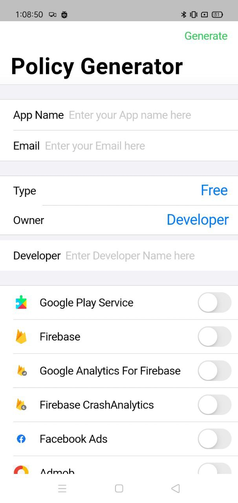
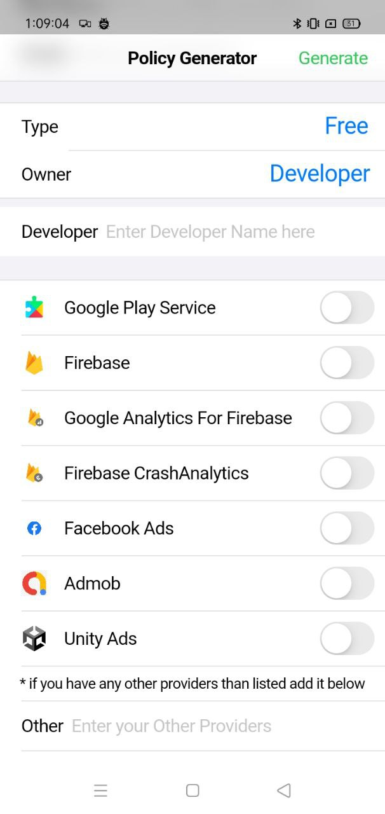
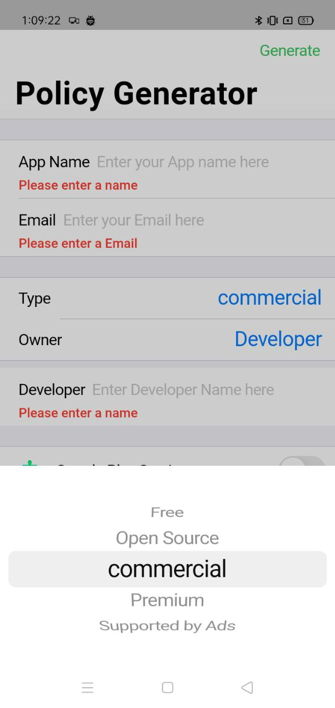
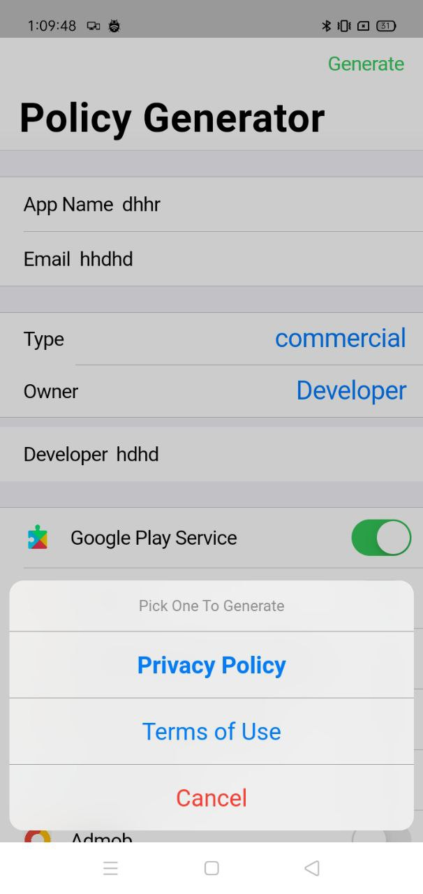
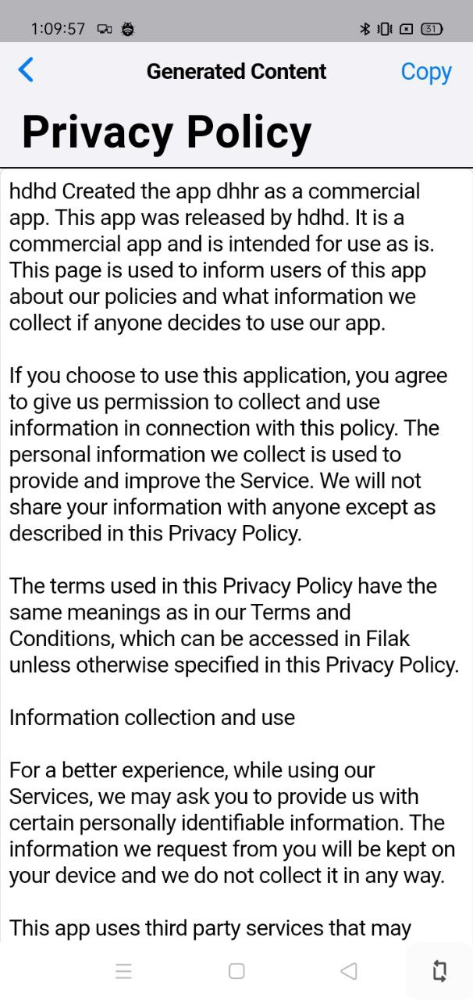
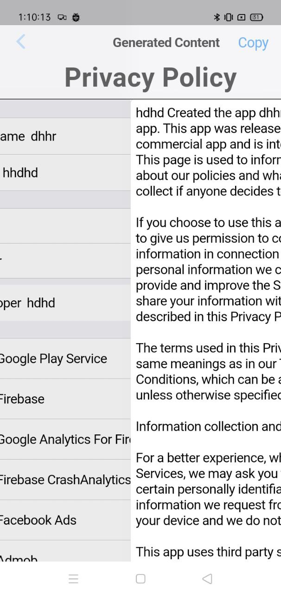

# privacy_policy_generator  

  
  
  
  
  
  

This is the IOS style Skin for my Playstore application.

With this project you can Generate privacy policy and terms of use for your application , It will be required to update in playstore Console of your applicication.

'You want my project , You can have it'

A few resources to get you started if this is your first Flutter project:

https://github.com/santhosh-D-subramani/Policy-Generator

For help getting started with Flutter development, view the
[online documentation](https://docs.flutter.dev/), which offers tutorials,
samples, guidance on mobile development, and a full API reference.
